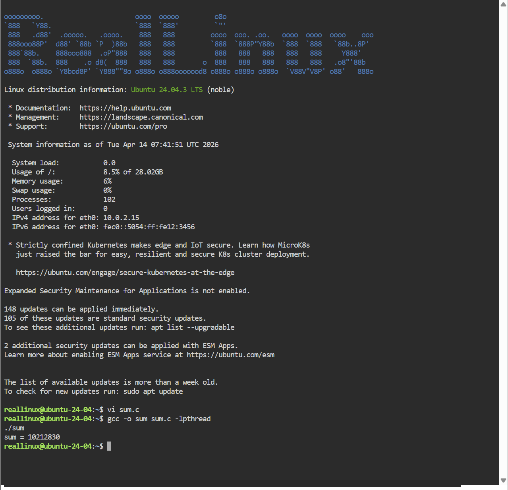
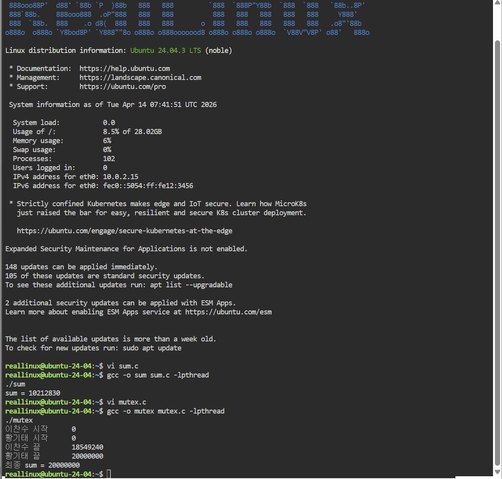
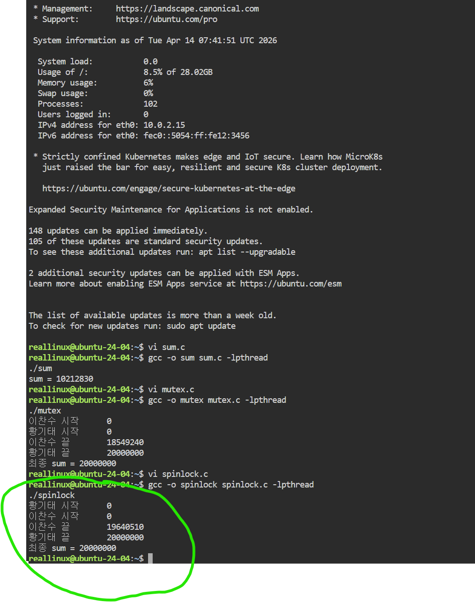
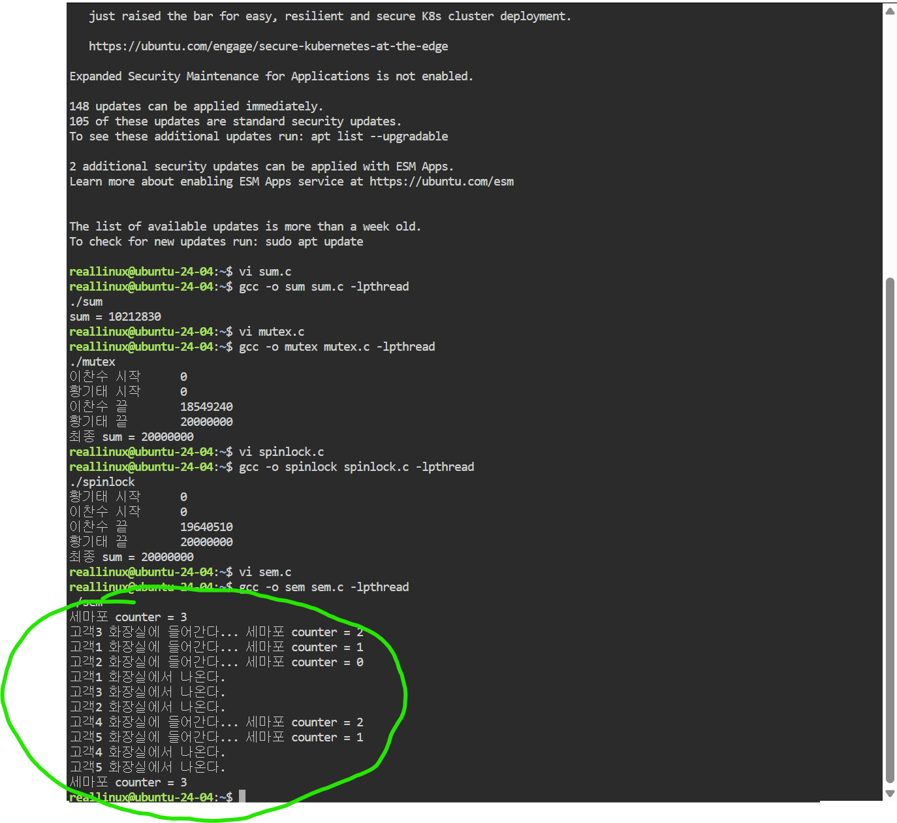
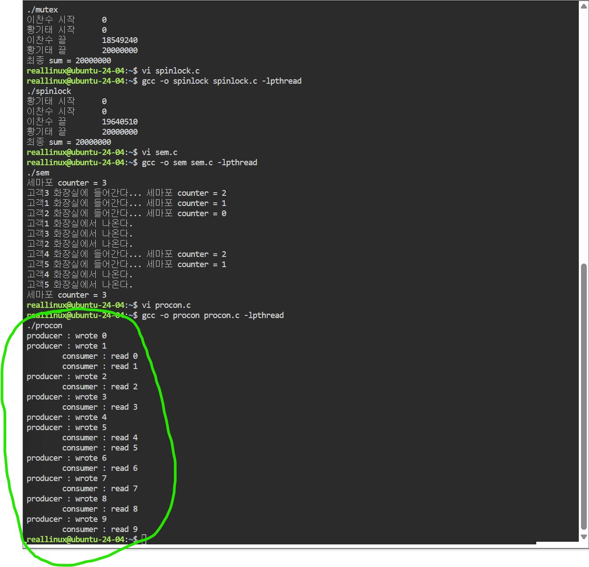

# 운영체제 6주차 과제 - 스레드 동기화 탐구문제 실습

## 탐구 6-1: 동기화 없는 공유변수 문제 (sum.c)

## 탐구 6-2: 뮤텍스(Mutex)를 이용한 동기화 (mutex.c)

## 탐구 6-3: 스핀락(Spinlock)을 이용한 동기화 (spinlock.c)

## 탐구 6-4: 세마포(Semaphore) 활용 사례 (sem.c)

## 탐구 6-5: 생산자-소비자 응용프로그램 (procon.c)

